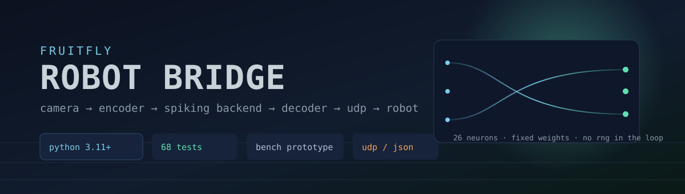
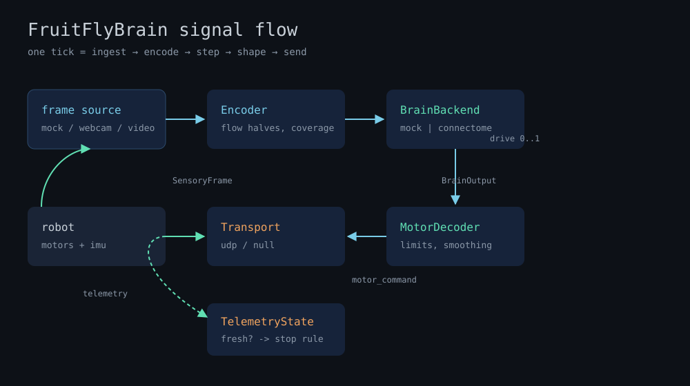
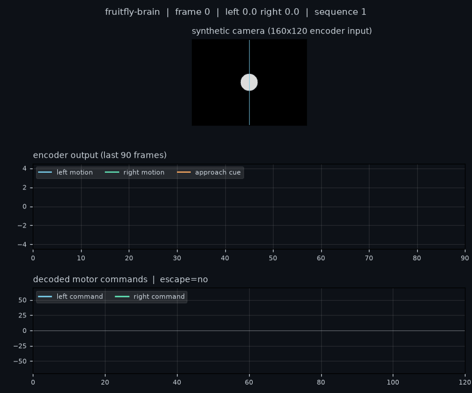

<div align="center">



# FruitFlyBrain Robot Bridge

**Camera to robot, with a small spiking backend in the middle.**


[](LICENSE)


[Quick start](#quick-start) · [Demo](#mock-demo) · [Architecture](#architecture) · [Limitations](#current-limitations) · [Roadmap](#roadmap)

</div>

A camera looks at the world, a small neural model decides, two motors move. This
repository is the glue in between: an encoder that turns frames into a handful of
sensory numbers, a pluggable backend that turns those numbers into two motor
drives, a decoder that shapes them into commands a microcontroller will accept,
and a strict little UDP protocol for both directions.

**Try it in 30 seconds.** The synthetic demo runs locally — no robot, no camera,
no network, no dataset.

> [!NOTE]
> There is no insect brain in this repository. The default backend is eight
> leaky activity groups; the second backend is a 26-neuron network whose weights
> are written out by hand. Both are demonstrators, sized so a reader can check
> the whole model in a sitting.

## What it does

- Runs locally with synthetic frames, a webcam or a video file.
- Estimates motion in the left and right half of the field, and the frame-to-frame
  growth of covered area (the approach cue).
- Steps a backend of your choice: `mock` (8 activity groups) or `connectome`
  (26 spiking neurons, fixed weights).
- Shapes two drives into motor commands with limits, dead zone, smoothing and
  per-side inversion; an escape bypasses the smoother.
- Speaks JSON/UDP in both directions, validates every packet, drops duplicates
  and out-of-order telemetry, counts what it rejects.
- Sends zero while telemetry is missing or older than `telemetry_timeout_ms`.
- Journals every run to JSONL so a bench session can be replayed.

## Architecture



`Frame source → Encoder → BrainBackend → MotorDecoder → UDP → robot`

`robot IMU → UDP telemetry → TelemetryState → (stop rule) → MotorDecoder`

Nothing in the pipeline holds a clock of its own: `Bridge.tick(frame, now_ms)`
is a function of its inputs, which is why the tests can drive a whole run in
milliseconds. Details in [docs/ARCHITECTURE.md](docs/ARCHITECTURE.md), wire
format in [docs/PROTOCOL.md](docs/PROTOCOL.md).

## Quick start

Requires Python 3.11+.

```bash
git clone https://github.com/fruitflyxyz/fruitfly-brain.git
cd fruitfly-brain
python3.11 -m venv .venv
source .venv/bin/activate
pip install -e ".[dev]"
fruitfly-brain --source mock --brain mock --frames 300
```

The default run lasts 300 frames (about ten seconds of simulated 30 fps), stays
in dry-run mode, and prints the packets it would send.

## Mock demo



*Rendered by `examples/render_demo.py` from the real encoder, the real backend
and the real decoder. It is a picture of the software's output, not a robot.*

```bash
python examples/run_mock.py                 # 90 frames, printable summary
python examples/render_demo.py out.gif      # re-render the animation above
fruitfly-brain --source webcam --dry-run    # your camera, still no robot
fruitfly-brain --source video --video clip.mp4 --brain connectome
```

## Talking to a robot

```bash
cp config.example.yaml config.yaml
# edit network.robot_host / robot_port / bind_port, then:
fruitfly-brain --config config.yaml
```

The [firmware scaffold](firmware/esp32_hbridge/README.md) is disarmed: the motor
hooks are `TODO` stubs and the watchdog is the only thing that is finished. Do
not flash it onto something that can hurt you before those hooks are written and
tested. No hardware run has been performed on this branch.

Two independent stop rules exist on purpose: this side sends zero when telemetry
goes quiet, and the microcontroller stops itself when commands go quiet. A
Python process that hangs cannot send the packet that says "stop".

## Repository structure

```text
assets/                    Banner, architecture diagram, rendered demo
src/fruitfly_brain/        CLI, config, encoder, decoder, protocol, telemetry
src/fruitfly_brain/brain/  Backend interface, 8-group mock, 26-neuron network
firmware/esp32_hbridge/    Disarmed ESP32 scaffold and protocol notes
examples/                  Runnable demo and GIF renderer
tests/                     68 checks: config, encoder, backends, decoder, protocol, loop
docs/                      Architecture, protocol, hardware, validation notes and the log
.github/workflows/test.yml Ruff + pytest on 3.11 and 3.12
```

## Current limitations

- **No hardware validation.** Everything here has run against synthetic frames
  and a `NullTransport`. The firmware has never been flashed.
- **The backends are demonstrators.** The connectome backend is a hand-written
  26-neuron graph, not anatomy. Its weights are tuned to make the harness light
  up, not to reproduce anything measured.
- **The approach cue is a proxy.** Covered-area growth replaced flow-based
  expansion after the flow version measured the wrong sign on synthetic blobs;
  the numbers are in [docs/VALIDATION.md](docs/VALIDATION.md).
- **UDP without authentication.** Any host on the bench network can send
  packets. There is a sequence gate, no cryptography.
- **Timing is best-effort.** `time.sleep` cannot hold 30 fps on a busy machine,
  and the loop does not compensate.
- **No simulation of the robot.** Wheels are two numbers between -60 and 60.

## Roadmap

- [x] Encoder, backends, decoder, protocol, CLI
- [x] Mock demo rendered from the live pipeline
- [x] Firmware scaffold with an independent watchdog
- [ ] Bench-validate the firmware on a real board
- [ ] Record real camera footage and compare against synthetic
- [ ] Timestamped journal replay that can drive the loop at recorded speed
- [ ] Second motor protocol (serial frames) for boards without WiFi

## Family

This repository is one of three that share an interface:

- [fruitfly-vision](https://github.com/fruitflyxyz/fruitfly-vision) — the encoder
  side, standalone, with calibration and packet export
- [fruitfly-motor](https://github.com/fruitflyxyz/fruitfly-motor) — the actuator
  side, standalone, with a receiver simulator and replay

They are separate packages on purpose: you can swap either end for your own and
keep the JSON in the middle.

## License

MIT — see [LICENSE](LICENSE).
